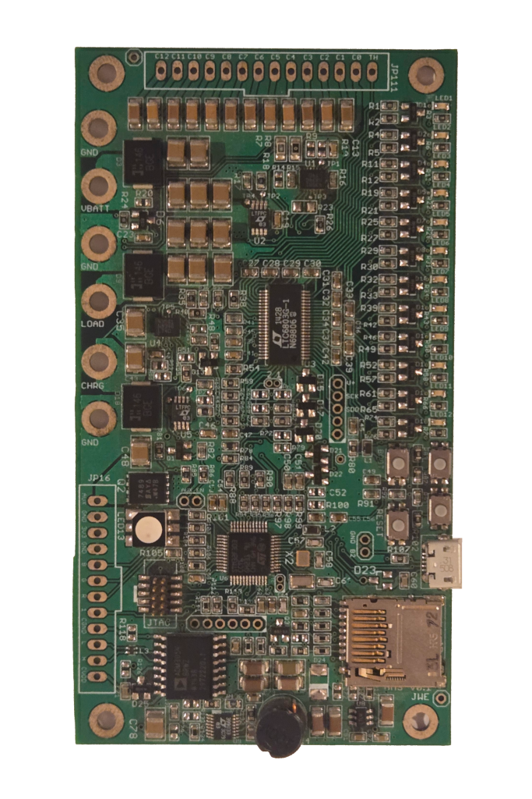
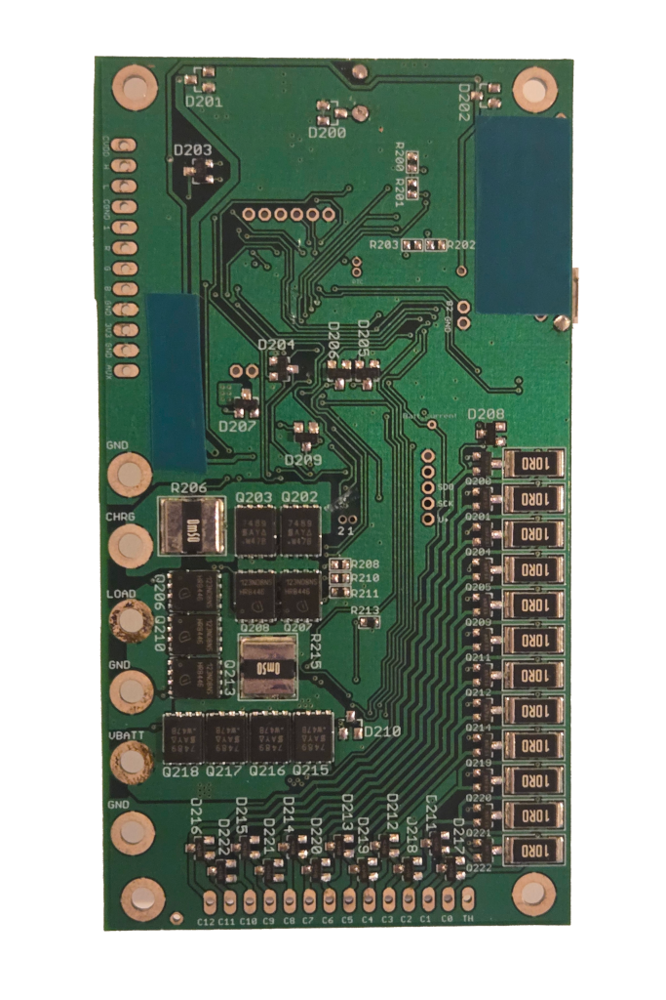

# Chibi-ECEN-BMS: 7S Lithium-Ion Battery Management System

A 7-cell lithium-ion battery management system designed as a student project for EMEN 5830 (Fundamentals of Systems Engineering) at the University of Colorado Boulder in 2015.


<p align="center">
  
  &nbsp;&nbsp;&nbsp;
  
</p>

## Overview

This BMS was designed for an electric-assist recumbent tricycle with a focus on battery monitoring, safety, and data logging. The design used the ChibiOS operating system, and includes CAN bus communication, microSD data logging, and comprehensive fault detection.

⚠️ **Educational Prototype** - This was a graduate student learning project from 2015 focused on PCB layout techniques for power electronics. While the design is complete and boards were fabricated, this should be considered a learning exercise rather than a production-ready design. Firmware development was not released as part of the project.

## Key Features

- **7S Lithium-Ion Battery Monitoring** - LT6803-based cell voltage monitoring
- **STM32F303 Microcontroller** - ARM Cortex-M4 with floating-point unit
- **Safety Features** - Overcurrent, overvoltage, undervoltage, and thermal protection
- **CAN Bus Interface** - ADM3054 isolated CAN transceiver for vehicle communication
- **Data Logging** - microSD card storage for voltage, current, temperature data
- **Power Management** - LT3990 buck-boost converter for auxiliary power
- **Debug Interface** - JTAG programming and debugging support
- **User Feedback** - RGB status LED, two buttons for user input

## Technical Specifications

- **Battery Configuration**: 7S (7 cells in series)
- **Cell Chemistry**: 18650 Lithium-Ion (Samsung ICR18650-30B, 3000mAh)
- **Voltage Range**: 19.6V - 29.4V (2.8V - 4.2V per cell)
- **Microcontroller**: STM32F303CBT6 (ARM Cortex-M4, 48MHz, 128KB Flash)
- **Battery Monitor**: LT6803-1 (multicell battery stack monitor)
- **Communication**: CAN 2.0B, USB 2.0 (micro-B connector)
- **Data Logging**: microSD card (SPI interface)
- **PCB**: 4-layer board, approximately 100mm x 75mm

See [docs/specifications.md](docs/specifications.md) for complete specifications.

## Systems Engineering Process

This project followed a rigorous systems engineering methodology as taught in EMEN 5830:

1. **Requirements Development** - Stakeholder needs analysis, system requirements derivation
2. **Concept of Operations** - Use cases, operational scenarios, system interactions
3. **Functional Analysis** - 21 iterations of Functional Flow Block Diagrams (FFDB)
4. **Trade Studies** - Component selection based on cost, performance, availability
5. **Design** - Schematic capture, PCB layout, mechanical integration
6. **Testing** - Comprehensive test procedures and validation

The [analysis/](analysis/) directory contains the complete systems engineering documentation, including all 21 FFDB iterations showing the evolution of the design through failure mode analysis.


## Hardware Versions

### Version 1 (v01) - Manufactured & Tested
Version 1 was designed in February 2015, manufactured in March 2015, and tested as part of the course project. Complete gerber files, BOM, and test documentation are included.

- **Status**: Manufactured, assembled, and tested
- **Manufacturing Files**: Complete gerbers available in `hardware/bms-v01/gerbers/`
- **Documentation**: Full schematic, layout, BOM, and test results included

### Version 2 (v02) - Design Iteration
Version 2 was a design iteration that incorporated lessons learned from v01 testing, including corrections to the 8MHz crystal package and expanded AUX power traces. This version was never manufactured and the design files remain in the Eagle source directory.

## Repository Structure

```
chibi-ecen-bms/
├── hardware/              # Manufacturing-ready files (PDFs, gerbers, BOM)
│   └── bms-v01/          # Version 1 (manufactured)
├── design-source/         # Native design files
│   ├── eagle/            # Eagle CAD schematics and layouts
│   ├── cubemx/           # STM32 configuration files
│   └── mechanical/       # SolidWorks models and renders
├── docs/                  # Documentation
├── analysis/              # Systems engineering analysis
│   ├── requirements/     # Requirements documentation
│   ├── failure-analysis/ # FFDB diagrams (21 iterations)
│   ├── calculations/     # Battery and system calculations
│   ├── trade-studies/    # Component selection analysis
│   └── diagrams/         # System block diagrams
├── datasheets/           # Key component datasheets
├── media/                # Photos, renders, and presentation
└── testing/              # Test procedures and results
```

## Getting Started

### Manufacturing

To manufacture this board:

1. Review the [schematic](hardware/bms-v01/bms_v01_schematic.pdf) and [layout](hardware/bms-v01/bms_v01_layout.pdf)
2. Order PCBs using the [gerber files](hardware/bms-v01/gerbers/)
3. Order components from the [BOM](hardware/bms-v01/bms_v01_assembly_bom.csv)
4. Refer to the [test procedure](testing/test-procedure.pdf) for validation

### Modifying the Design

The source Eagle CAD files are in [design-source/eagle/](design-source/eagle/). The STM32 peripheral configuration can be modified using STM32CubeMX with the [.ioc file](design-source/cubemx/bms_v01.ioc).

## Documentation

- **[Specifications](docs/specifications.md)** - System requirements and performance specs
- **[Pinout](docs/pinout.md)** - Connector pinouts and signal definitions
- **[Hardware README](hardware/README.md)** - Manufacturing file details


## Known Issues

Version 1 has two known issues that were addressed in the v02 design:

1. **8MHz Crystal Package** - Incorrect footprint requires rework or substitution
2. **AUX Power Trace** - Undersized trace for auxiliary power distribution

Workarounds: The crystal issue can be resolved by hand-soldering the correct package or using an adapter. The power trace issue can be addressed by adding solder to thicken the trace or adding a parallel wire jumper.

## License

This project is released under the MIT License. See [LICENSE](LICENSE) for details.

Copyright (c) 2015 Jone Lay

You are free to use, modify, and distribute this design for any purpose, with attribution.

## Open Source Hardware

This project is open source hardware. The design files, manufacturing files, and documentation are freely available for educational and non-commercial use.

## Disclaimer

*This project is shared for educational purposes and as a portfolio piece. It was a graduate student project from 2015. While care was taken in the design and the hardware was successfully manufactured and tested, this is not a production-ready design. Use at your own risk. Battery management systems must be designed with extreme care for safety - this design is presented for educational purposes only.
